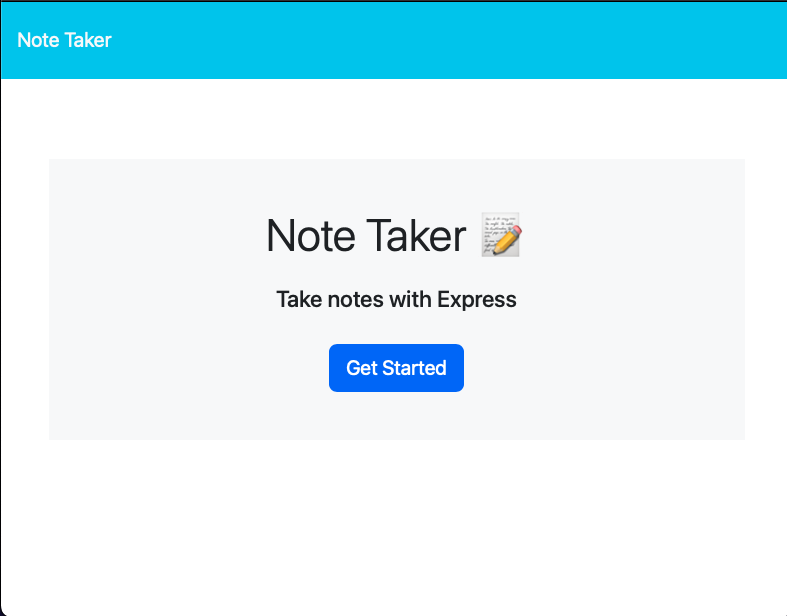
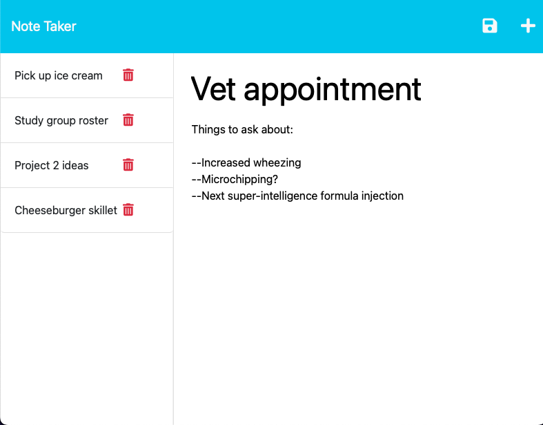
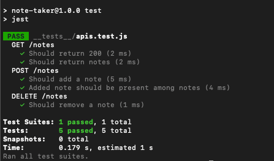

# Simple Note Taker 

## Description

The Simple Note Taker is a web application that enables a user to enter notes with a title and text content, and saves those notes. The user can access any note from the list and read its content. It owes its existance to our need for a very simple note-taking app, with extraneous distracting features stripped out.

## Table of Contents

* [Installation Instructions](#installation-instructions)
* [Usage Information](#usage-information)
* [Test Instructions](#test-instructions)
* [Credits](#credits)
* [Software License](#software-license)
* [Contact the Developer](#contact-the-developer)

## Installation Instructions

The back end of the Simple Note Taker is run using Express on Node.js. With Node and npm installed on the host server, choose or create a directory to house the application. Into that directory, place:
* The `public` directory and its contents
* The `helpers` directory and its contents
* The `routes` directory and its contents
* The `package.json` file
All application dependencies are npm modules. Run `npm i` in the CLI to download and install them.

To start the server, run `npm start` in the CLI. The Note Taker is set to run using nodemon; to change the engine to simply node, edit the package.json file to replace `"nodemon server.js"` with `"node server.js"` in the `scripts` object.

While running, the server will default to port 3001 if an environment variable is not set to determine the port.

## Usage Information

Using the Simple Note Taker is, well, simple: in any web browser, launch the website. From the splash screen, click the "Get Started" button to access the notes page.

On the notes page, you will find the list of saved notes in a column on the left hand side, each with a "trash can" icon. Click on a note title to see the content of the note in the main portion of the screen. Click a note's trash can to delete it.

To create a new note, click the "+" icon in the upper right corner of the page, and type a title and note text in the appropriate fields. Once those are entered, click the "floppy disk" icon in the upper right corner to save it. Note: the save button is not present until there is something to save. It will appear once there is text in BOTH the title field and the content field.

## Test Instructions

To test the correct operation of the Simple Note Taker, start the server by running `npm start` in your CLI. Then run `npm test`. The testing suite is written for the jest and supertest npm modules.

The tests will confirm the appropriate operation of the GET, POST and DELETE functions of the application.

## Credits

The Simple Note Taker's front end was provided by the staff of the University of Minnesota Full Stack Coding Boot Camp. The back end code is written by Lee Klusky, with the help and guidance of said staff. It owes its functioning to the creators of and contributors to Node.js and npm, and to the various dependencies.

Guidance on the user of the supertest module came from a post by Mary Gathoni at [MakeUseOf.com](https://www.makeuseof.com/express-apis-jest-test/?newsletter_popup=1).

## Software License

©2023, Lee Klusky

This software is covered by a [MIT License](https://opensource.org/licenses/MIT).

Permission is hereby granted, free of charge, to any person obtaining a copy of this software and associated documentation files (the "Software"), to deal in the Software without restriction, including without limitation the rights to use, copy, modify, merge, publish, distribute, sublicense, and/or sell copies of the Software, and to permit persons to whom the Software is furnished to do so, subject to the following conditions:

The above copyright notice and this permission notice shall be included in all copies or substantial portions of the Software.

THE SOFTWARE IS PROVIDED "AS IS", WITHOUT WARRANTY OF ANY KIND, EXPRESS OR IMPLIED, INCLUDING BUT NOT LIMITED TO THE WARRANTIES OF MERCHANTABILITY, FITNESS FOR A PARTICULAR PURPOSE AND NONINFRINGEMENT. IN NO EVENT SHALL THE AUTHORS OR COPYRIGHT HOLDERS BE LIABLE FOR ANY CLAIM, DAMAGES OR OTHER LIABILITY, WHETHER IN AN ACTION OF CONTRACT, TORT OR OTHERWISE, ARISING FROM, OUT OF OR IN CONNECTION WITH THE SOFTWARE OR THE USE OR OTHER DEALINGS IN THE SOFTWARE.

## Questions?

Contact me at <a href="mailto:lkbootcamp@yahoo.com">lkbootcamp@yahoo.com</a>, or visit my [GitHub profile](https://www.github.com/lkalliance).